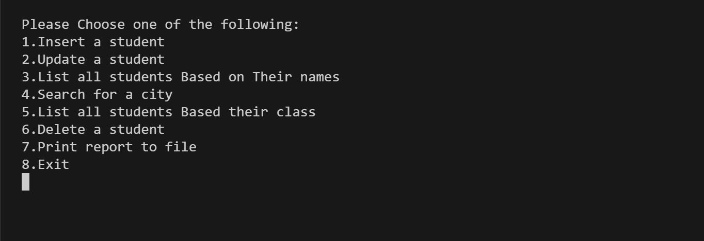

# Student Information Management System Using Trees  

The Student Information Management System is a tree-based database designed to efficiently store, manage, and retrieve student records. This system utilizes a Binary Search Tree (BST) to dynamically manage student data, ensuring efficient insertion, deletion, and retrieval. By structuring data hierarchically, the system enables quick lookups, sorted listing, and flexible querying based on various attributes such as name, class, and city.

## Features  

- `Insert a Student` – Add a new student record to the tree.  
- `Update a Student` – Modify existing student details such as name, class, or city.  
- `List All Students Based on Their Names` – Retrieve and display student records sorted alphabetically.  
- `Search for a City` – Find students based on their city of residence.  
- `List All Students Based on Their Class` – Retrieve and display students grouped by class.  
- `Delete a Student` – Remove a student record while maintaining tree balance.  
- `Print Report to File` – Generate a structured report of student data and export it to a file for record-keeping.  

## File Descriptions

- `Program.c`: Main C program 
- `students.data.txt`: Input file containing the students data.

## Example Usage

To run the program, provide the input file "students.data.txt" containing the students data and Run the Program.c file:

## Contact

For any inquiries, reach out via:

- Email: [miar.taweel04@gmail.com](mailto\:miar.taweel04@gmail.com)
- GitHub: [miarTaweel](https://github.com/miarTaweel)
